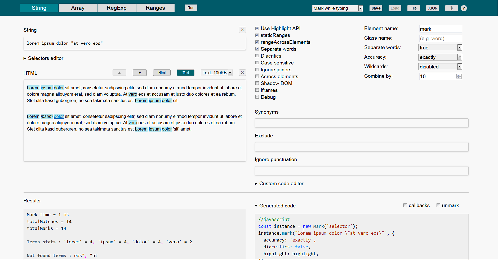

# advance-mark.js-playground



### Description
It **only** correctly works with [https://github.com/angezid/advanced-mark.js](https://github.com/angezid/advanced-mark.js) version 2.  
Early versions of `advanced-mark.js` and `mark.js` v9.0.0 and npm package v8.11.1 are supported by playground version 1 - see releases.

### Install advance-mark.js-playground
Clone or download this repository and run:
```
npm install && npm run build
```

### Server
To play with `iframes` option, you need to launch the server. It also opens `build/index.html` file. Server url - `http://localhost:8080`.
```
npm run server
```

### License

[MIT](LICENSE)
