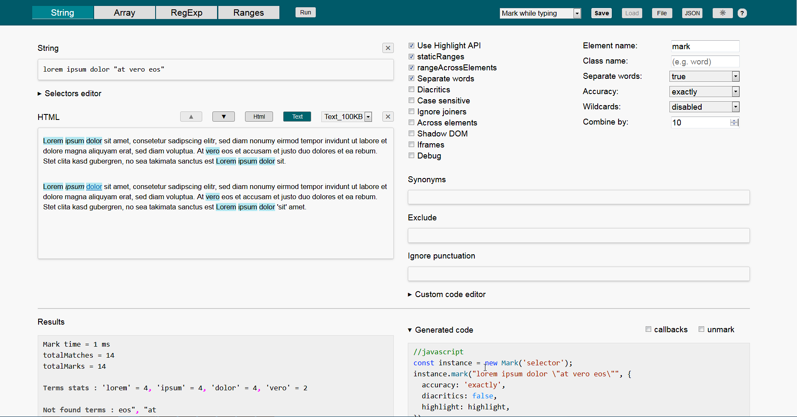

# advance-mark.js-playground



### Description
This project is designed to demonstrate the capabilities of the [advanced-mark.js](https://github.com/angezid/advanced-mark.js) library and practically provides full functionality.

### Online playground
See the online [playground v2.7](https://angezid.github.io/advanced-mark.js/playground) for the *advanced-mark.js* version 2.7  
or [playground v3.x](https://angezid.github.io/advanced-mark.js/playground-v3.x) for the latest *advanced-mark.js* version.

### Install advance-mark.js-playground
Clone or download this repository and run:
```
npm install && npm run build
```

### License

[MIT](LICENSE)
